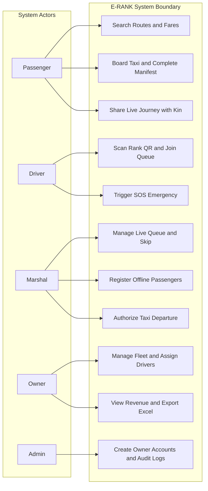
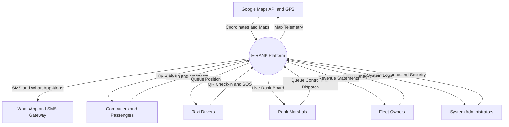
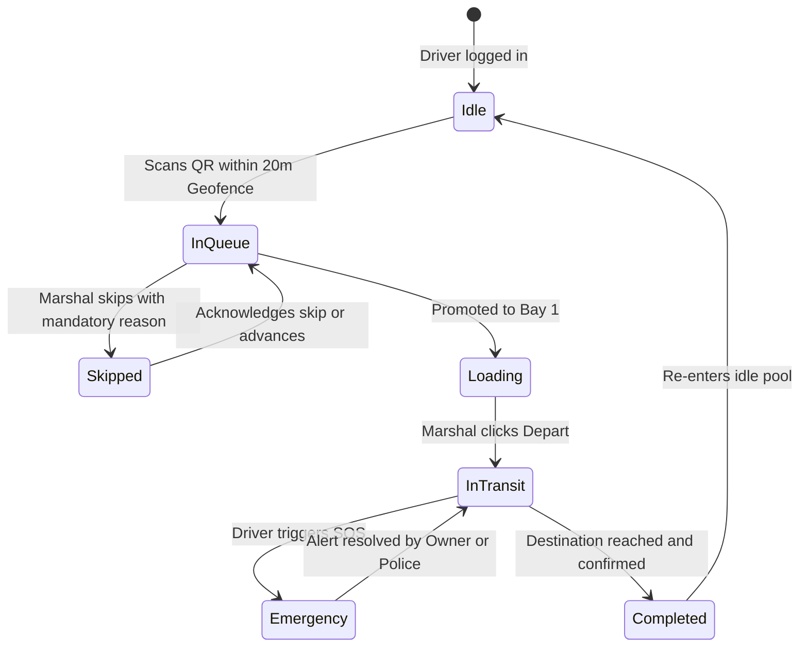
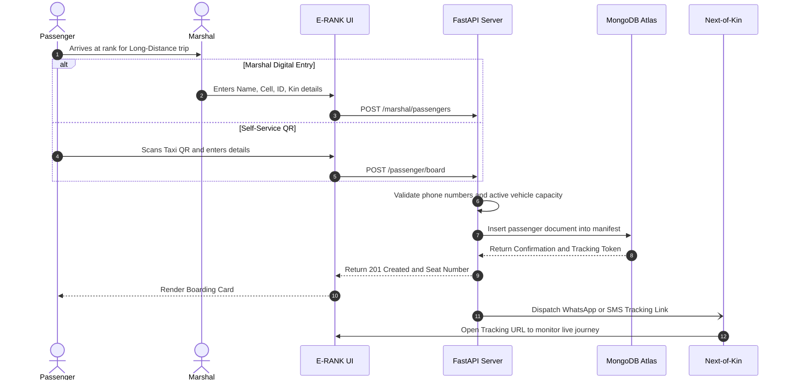
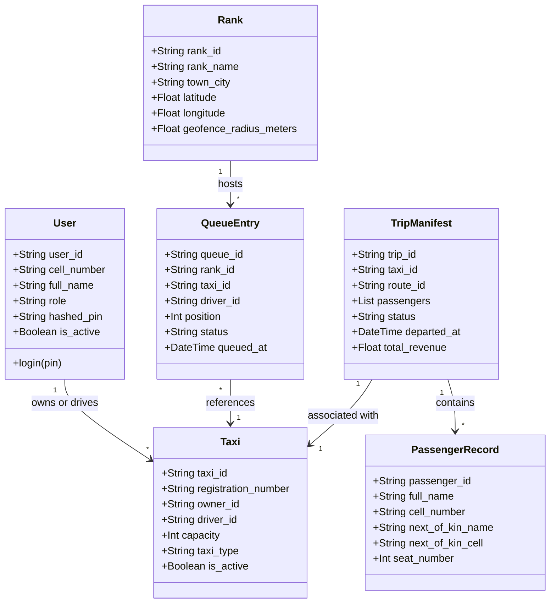

# E-RANK: System Analysis & Design

**Assessment:** NPRT630 Project – Phase 2: System Analysis & Design  
**Programme:** Diploma in Information and Communication Technology  
**Institution:** Sol Plaatje University  
**Module Code:** NPRT630  
**Examiner:** Mr. Melvin Kisten  
**Group Name:** PMP Solutions  
**Due Date:** 20 April 2026  
**Repository:** [https://github.com/SiyaJNdzobs/NPRT63PMPSOLUTIONS/tree/main](https://github.com/SiyaJNdzobs/NPRT63PMPSOLUTIONS/tree/main)  
**Live Application:** [eRank App on Render](https://erank.onrender.com)

---

## Group Members

| Full Name | Student Number | GitHub Profile |
| :--- | :--- | :--- |
| **Oarabetse Morata** | 202406427 | [@Oarabetse-pixel](https://github.com/Oarabetse-pixel) |
| **Phuti Setati** | 202435062 | [@SetatiPhillipine](https://github.com/SetatiPhillipine) |
| **Kholofelo Phalakatsela** | 202306829 | [@IamKholofeloPhala](https://github.com/IamKholofeloPhala) |
| **Louisa Mdluli** | 202324412 | [@Louisa322](https://github.com/Louisa322) |
| **Siyabonga José Ndzobondzobo** | 202441850 | [@SiyaJNdzobs](https://github.com/SiyaJNdzobs) |

---

## Table of Contents
1. [Introduction](#1-introduction)
2. [Business Processes & Workflow Mapping](#2-business-processes--workflow-mapping)
3. [Non-Functional Requirements (Measurable Targets)](#3-non-functional-requirements-measurable-targets)
4. [Functional Requirements (IPO Model)](#4-functional-requirements-ipo-model)
5. [UML Diagrams](#5-uml-diagrams)
   - 5.1 Use Case Diagram
   - 5.2 Context Diagram
   - 5.3 Driver State Machine Diagram
   - 5.4 Passenger Registration Sequence Diagram
   - 5.5 System Class Diagram
6. [Work Breakdown Structure (WBS)](#6-work-breakdown-structure-wbs)
7. [Project Timeline & Gantt Chart](#7-project-timeline--gantt-chart)
8. [Conclusion](#8-conclusion)

---

## 1. Introduction
Phase 2 bridges the conceptual proposal of E-RANK with concrete software engineering specifications. This document defines the business processes, functional transformations using the Input-Process-Output (IPO) model, measurable non-functional quality gates, comprehensive UML diagrams, and project management schedules.

---

## 2. Business Processes & Workflow Mapping

### 2.1 Driver Queue Registration Process
```
[Driver Arrives at Rank]
         │
         ▼
[Driver opens E-RANK & selects Scan QR]
         │
         ▼
[System acquires device GPS latitude/longitude]
         │
         ├──── Outside 20m geofence ───► [Display Error: "Must be within 20m of Rank"]
         │
         ▼ (Within geofence)
[System validates Taxi Registration against Owner Fleet]
         │
         ▼
[System checks Duplicate Queue Entry]
         │
         ▼
[Driver assigned next sequential FIFO queue index]
         │
         ▼
[Marshal Dashboard & Driver Screen update in real-time]
```

### 2.2 Passenger Registration for Long-Distance Travel
```
[Passenger approaches Marshal / Loading Bay]
         │
         ├── Option A: Passenger Smartphone Self-Boarding
         │     └─► Scans vehicle plate QR -> enters self & kin details -> submits
         │
         └── Option B: Marshal Digital Capture (Offline / No-Phone)
               └─► Marshal enters Name, Cell, ID, Destination, Next-of-Kin
         │
         ▼
[System validates cell numbers & emergency contact completeness]
         │
         ▼
[Record persisted to Cloud Manifest linked to Trip ID]
         │
         ▼
[Encrypted SMS / WhatsApp tracking link generated for Next-of-Kin]
```

### 2.3 Taxi Departure Notification Process
```
[Vehicle reaches capacity (e.g., 15/15 seats filled)]
         │
         ▼
[Marshal reviews digital manifest & clicks "DEPART"]
         │
         ▼
[System closes Manifest -> triggers gross fare calculation]
         │
         ▼
[In-app departure push sent to Driver]
         │
         ▼
[Vehicle removed from active queue -> Next vehicle promoted to Bay 1]
         │
         ▼
[Owner dashboard revenue aggregate increments automatically]
```

### 2.4 Fare Collection Recording Process
```
[Marshal receives cash or verifies digital proof-of-payment]
         │
         ▼
[Marshal enters fare amount per seat into rank terminal]
         │
         ▼
[System checks fare against official registered route tariff]
         │
         ▼
[System logs transaction with Marshal ID, Vehicle ID, and timestamp]
         │
         ▼
[Daily rank financial ledger updated]
```

### 2.5 Trip Confirmation and Monitoring Process
```
[Driver arrives at final destination rank / terminal]
         │
         ▼
[Driver clicks "Complete Trip" with destination GPS confirmation]
         │
         ▼
[Trip status transitioned from 'In-Transit' to 'Completed']
         │
         ▼
[Passenger tracking link marks journey as safely concluded]
         │
         ▼
[Vehicle flagged as 'Available' to re-queue at destination rank]
```

---

## 3. Non-Functional Requirements (Measurable Targets)

| Category | Quality Requirement | Measurable Metric / Acceptance Criteria |
| :--- | :--- | :--- |
| **Reliability** | Consistent queue ordering and zero data loss under intermittent networks. | • **99.5% uptime** during operational hours (05:00–21:00).<br>• Local SQLite/IndexedDB queue fallback recovers 100% of offline scans upon reconnect.<br>• Automated crash recovery in **< 15 seconds**. |
| **Availability** | Continuous access for multi-provincial routes and after-hours trip lookup. | • **24/7 service availability** hosted on containerized Render infrastructure.<br>• Scheduled maintenance window strictly capped at **< 1 hour/week** during off-peak hours (01:00–04:00). |
| **Security** | Protection of passenger identities and driver authentication integrity. | • **Bcrypt salt hashing (12 rounds)** for all user PINs and passwords.<br>• JWT Bearer Token session expiration enforced after 24 hours.<br>• Full TLS 1.3 encryption in transit; POPIA compliance for next-of-kin records. |
| **Maintainability** | Clean, modular codebase allowing rapid feature deployment. | • Separation of concerns: FastAPI backend routes separated from services; React UI components decoupled.<br>• Automated test suite achieving **> 85% code coverage** via `pytest`.<br>• Critical bug patch deployment pipeline **< 2 hours**. |
| **Portability** | Universal cross-device operability across budget mobile hardware. | • Responsive web application optimized for Chrome, Edge, and Safari across screen sizes (360px to 1920px).<br>• Zero external app store installation required (Progressive Web App support). |
| **Performance** | Rapid processing in high-density rank environments. | • QR code scanning to queue assignment executed in **< 1.8 seconds**.<br>• Public search results returned in **< 250 milliseconds**.<br>• Handles up to **100 concurrent requests per rank** without latency increase > 10%. |

---

## 4. Functional Requirements (IPO Model)

### 4.1 Driver Queue Registration
- **Input:** Driver ID, Taxi Registration Number, Rank GPS Latitude/Longitude, Destination Route ID.
- **Process:** Verify driver credentials; check 20m geofence radius via Haversine formula; ensure vehicle is not already queued; compute next sequence index.
- **Output:** Confirmed queue position number, real-time board update on Marshal and Driver screens.

### 4.2 Passenger Registration for Long-Distance Travel
- **Input:** Passenger Full Name, Contact Number, Destination, Seat Number, Next-of-Kin Name, Next-of-Kin Cell Phone.
- **Process:** Validate South African phone number format; link passenger to active vehicle manifest; generate secure tracking token.
- **Output:** Manifest entry created, seat marked reserved, encrypted WhatsApp tracking URL dispatched.

### 4.3 Marshal Queue Management
- **Input:** Target vehicle registration, Action (`Promote`, `Skip`, `Remove`), Mandatory Skip Reason text.
- **Process:** Validate Marshal authorization; mutate queue ordering indices atomically; push skip alert notification to driver dashboard.
- **Output:** Re-ordered queue table, push alert banner displayed to skipped driver.

### 4.4 Departure Notification & Execution
- **Input:** Vehicle ID, Marshal Departure confirmation trigger.
- **Process:** Lock manifest from further edits; compute total fare revenue (Passengers × Fare); set vehicle status to `Departed`; advance queue.
- **Output:** Audio/visual departure signal, SMS/in-app alert to driver, revenue ledger updated.

### 4.5 Fare Collection Recording
- **Input:** Route ID, Taxi Registration Number, Fare Amount, Payment Mode (`Cash` / `Digital`).
- **Process:** Cross-reference amount against route tariff; log transaction under Marshal shift; compute running association levy.
- **Output:** Digitally signed transaction record, daily takings total incremented on Owner dashboard.

### 4.6 Trip Confirmation by Driver
- **Input:** Trip ID, Final GPS coordinates, Driver Confirmation action.
- **Process:** Verify driver ID against active trip; record arrival timestamp; update vehicle status to `Idle/Available`.
- **Output:** Trip marked completed, passenger tracking session closed with arrival confirmation.

### 4.7 Owner Trip Monitoring & Reporting Dashboard
- **Input:** Owner ID, Date Range Filter (`Today`, `This Week`, `This Month`), Vehicle Filter.
- **Process:** Aggregate completed operations, sum gross revenues, calculate operational averages, generate `.xlsx` binary stream.
- **Output:** Live dashboard charts, downloadable executive Excel report with formatted columns and totals.

### 4.8 Route & Availability Lookup for Commuters
- **Input:** Origin search string, Destination search string, or Keyword query.
- **Process:** Query MongoDB indexed route documents; fetch active rank queues; compute estimated waiting time based on queued vehicles.
- **Output:** Route cards with distance, standardized fare, rank location map link, and live queue count.

---

## 5. UML Diagrams

### 5.1 Use Case Diagram


### 5.2 Context Diagram


### 5.3 Driver State Machine Diagram


### 5.4 Sequence Diagram: Long-Distance Passenger Registration


### 5.5 System Class Diagram


---

## 6. Work Breakdown Structure (WBS)

```
1.0 E-RANK Project
├── 1.1 Project Inception & Research (Phase 1)
│   ├── 1.1.1 Stakeholder Interviews (Indian Centre Rank)
│   ├── 1.1.2 Competitive Gap Analysis (Loop, WOW, FairPay)
│   └── 1.1.3 Project Proposal & Architecture Definition
├── 1.2 System Analysis & Specification (Phase 2)
│   ├── 1.2.1 Business Process Modelling & User Stories
│   ├── 1.2.2 Non-Functional Metric Target Definition
│   ├── 1.2.3 Functional IPO Requirements Specification
│   └── 1.2.4 UML Architectural Diagramming
├── 1.3 Prototype & Data Architecture (Phase 3)
│   ├── 1.3.1 Low-Fidelity & High-Fidelity UI Wireframing
│   ├── 1.3.2 Usability Lab Testing (Moroka Room 112)
│   ├── 1.3.3 Heuristic Evaluation & Design Iterations
│   └── 1.3.4 MongoDB Schema Design & Index Tuning
└── 1.4 Implementation, Testing & Deployment (Phase 4)
    ├── 1.4.1 FastAPI Backend Development & Auth Engine
    ├── 1.4.2 React Frontend Role Dashboards Implementation
    ├── 1.4.3 GPS Geofencing & QR Code Engine
    ├── 1.4.4 Automated Testing (Pytest & Jest Suites)
    └── 1.4.5 Cloud Deployment to Render & Production Handover
```

---

## 7. Project Timeline & Gantt Chart

| WBS ID | Task Name | Start Date | End Date | Dependencies | Assigned Lead |
| :--- | :--- | :--- | :--- | :--- | :--- |
| **1.1** | Phase 1: Problem Definition & Research | 13 Feb 2026 | 13 Mar 2026 | None | Siyabonga Ndzobondzobo |
| **1.2** | Phase 2: Requirements & UML Modelling | 14 Mar 2026 | 20 Apr 2026 | 1.1 | Oarabetse Morata |
| **1.3** | Phase 3: UI Prototyping & Database Design | 21 Apr 2026 | 25 May 2026 | 1.2 | Phuti Setati |
| **1.4.1**| Backend REST API Development | 26 May 2026 | 10 Jul 2026 | 1.3 | Kholofelo Phalakatsela |
| **1.4.2**| Frontend React Implementation | 10 Jun 2026 | 30 Jul 2026 | 1.3 | Louisa Mdluli |
| **1.4.3**| System Integration & Geofence Engine | 01 Aug 2026 | 20 Aug 2026 | 1.4.1, 1.4.2 | Siyabonga Ndzobondzobo |
| **1.4.4**| Field Usability & Automated Testing | 21 Aug 2026 | 15 Sep 2026 | 1.4.3 | Entire Team |
| **1.4.5**| Phase 4 Final Submission & Demo Video | 16 Sep 2026 | 01 Oct 2026 | 1.4.4 | Entire Team |

---

## 8. Conclusion
Phase 2 rigorously establishes the system specifications, data flows, and architectural standards governing the E-RANK platform. With unambiguous IPO requirements, mathematically verified non-functional constraints, and comprehensive UML blueprints, the development team has transitioned from operational problem definition into disciplined technical execution.
