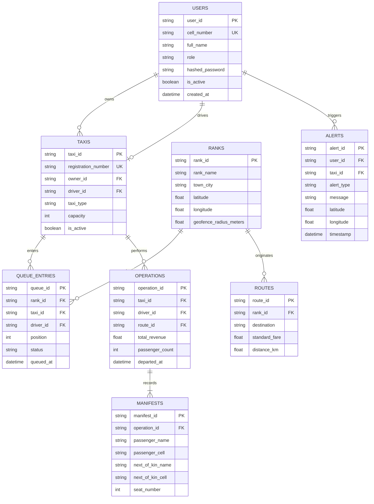

# E-RANK: Prototype & Database Design

**Assessment:** NPRT630 Project – Phase 3: Prototype & Data Design  
**Programme:** Diploma in Information and Communication Technology  
**Institution:** Sol Plaatje University  
**Module Code:** NPRT630  
**Examiner:** Mr. Melvin Kisten and Dr Silas Verkijika

**Group Name:** PMP Solutions  
**Due Date:** 25 May 2026  
**Repository:** [https://github.com/SiyaJNdzobs/NPRT63PMPSOLUTIONS/tree/main](https://github.com/SiyaJNdzobs/NPRT63PMPSOLUTIONS/tree/main)  
**Live Application:** [eRank App on Render](https://erank.onrender.com)

---

## Group Members

| Full Name | Student Number | GitHub Profile |
| :--- | :--- | :--- |
| **Oarabetse Morata** | 202406427 | [@Oarabetse-pixel](https://github.com/Oarabetse-pixel) |
| **Phuti Setati** | 202435062 | [@SetatiPhillipine](https://github.com/SetatiPhillipine) |
| **Kholofelo Phalakatsela** | 202306829 | [@IamKholofeloPhala](https://github.com/IamKholofeloPhala) |
| **Louisa Mdluli** | 202324412 | [@Louisa322](https://github.com/Louisa322) |
| **Siyabonga José Ndzobondzobo** | 202441850 | [@SiyaJNdzobs](https://github.com/SiyaJNdzobs) |

---

## Table of Contents
1. [Introduction to Phase 3](#1-introduction-to-phase-3)
2. [Interface Mock-Ups & Screen Architecture](#2-interface-mock-ups--screen-architecture)
   - 2.1 Login & Authentication Flow
   - 2.2 Registration & Onboarding
   - 2.3 Role-Specific Dashboards
   - 2.4 Data Entry Forms & Manifests
   - 2.5 Admin Oversight & Audit Panels
   - 2.6 Report Generation & Excel Export
3. [User Usability Testing (Round 1)](#3-user-usability-testing-round-1)
4. [Heuristic Evaluation Scores](#4-heuristic-evaluation-scores)
5. [Critical Usability Issues & Design Iterations](#5-critical-usability-issues--design-iterations)
6. [Database Design: Entity Relationship Diagram (ERD)](#6-database-design-entity-relationship-diagram-erd)
7. [Comprehensive Entity Specifications](#7-comprehensive-entity-specifications)
8. [Relationship Justifications](#8-relationship-justifications)
9. [Database Technology Choice & Justification](#9-database-technology-choice--justification)
10. [Conclusion](#10-conclusion)

---

## 1. Introduction to Phase 3
Phase 3 translates the functional blueprints of E-RANK into tangible user interface mock-ups and a scalable database schema. This phase documents empirical user research conducted in the usability laboratory at Sol Plaatje University, records heuristic evaluations, details iterative design improvements, and establishes an enterprise-grade document database architecture.

---

## 2. Interface Mock-Ups & Screen Architecture

### 2.1 Login & Authentication Flow
- **Purpose:** Secure, role-differentiated access using phone numbers and hashed 6-digit PINs / passwords.
- **Design Elements:**
  - Distinct role selection tabs (`Passenger`, `Driver`, `Marshal`, `Owner`, `Admin`).
  - Single numeric phone input with validation and clear error text.
  - Masked PIN input with show/hide toggle.
  - Persistent feedback line indicating: *"Signing in as: [Selected Role]"*.

### 2.2 Registration & Onboarding
- **Purpose:** Onboarding for passengers and drivers with minimal cognitive friction.
- **Design Elements:**
  - Multi-step progressive disclosure wizard (Personal Details → Credentials → Verification).
  - Client-side validation preventing submission of malformed cell numbers.

### 2.3 Role-Specific Dashboards
1. **Driver Dashboard:**
   - Real-time queue status card displaying active position (e.g. `Position #2 of 8`).
   - Integrated camera QR Scanner with 20m GPS radius validation.
   - High-visibility Red Emergency SOS Button for rapid distress broadcasting.
   - In-app notification banner for marshal skip reasons with an acknowledgment button.
2. **Marshal Dashboard:**
   - Real-time queue board showing loading bays, waiting taxis, and vehicle registrations.
   - Quick-action controls: `Add Taxi`, `Skip Vehicle (with reason)`, and `DEPART`.
   - Toggle switch for Rank Geofence enforcement.
   - Offline passenger manifest capture drawer.
3. **Passenger Dashboard:**
   - Origin-to-Destination route search bar (e.g. *"Kimberley to Bloemfontein"*).
   - Route fare list, active rank operating updates, and Google Maps directions link.
   - Digital self-boarding card with seat allocation and WhatsApp live journey sharing.
4. **Owner Dashboard:**
   - Fleet overview table showing vehicle registrations, assigned drivers, and active routes.
   - Live revenue metrics: daily gross takings, completed trip counts, and monthly projections.
   - Executive Excel statement download button.
5. **Admin Panel:**
   - Complete system governance: Owner account creation and credential management.
   - System-wide audit log table with immutable timestamps, IP addresses, and event types.

### 2.4 Data Entry Forms & Manifests
- **Passenger Manifest Capture Form:** Form with fields for Passenger Name, Cell Number, National ID, Destination, and Next-of-Kin details.
- **Taxi Registration Form:** Capture fields for Number Plate, Vin/Chassis Number, Seating Capacity (15/22), and Vehicle Type.

### 2.5 Report Generation & Excel Export
- High-level financial reporting module that compiles completed trip operations into an executive `.xlsx` workbook featuring:
  - Deep Navy headers (`#1E3A5F`) with crisp white typography.
  - Formatted currency columns (`ZAR R0.00`).
  - Automated sum formulas for gross turnover and association levies.

---

## 3. User Usability Testing (Round 1)
- **Location:** Moroka Seminar Room 112, Sol Plaatje University.
- **Participants:** Five (5) representative users:
  - P1: Taxi Driver (12 years rank experience)
  - P2: Senior Taxi Marshal (Indian Centre Rank)
  - P3: Minibus Fleet Owner
  - P4: Daily Student Commuter (Sol Plaatje University)
  - P5: Long-Distance Cross-Provincial Passenger
- **Methodology:** Think-Aloud Protocol. Participants were given realistic task scenarios without guidance, and all interactions, hesitations, and verbal feedback were recorded.

---

## 4. Heuristic Evaluation Scores

Based on Nielsen's 10 Usability Heuristics, the initial prototype achieved the following benchmark scores (rated out of 10):

| Heuristic Principle | Initial Prototype Score | Post-Iteration Score | Improvement Key |
| :--- | :---: | :---: | :--- |
| **1. Visibility of System Status** | 6 / 10 | **9 / 10** | Added persistent role indicator & live queue tracker. |
| **2. Match Between System & Real World** | 5 / 10 | **9 / 10** | Replaced technical jargon with rank terminology (*"Load Bay"*, *"Depart"*). |
| **3. User Control & Freedom** | 4 / 10 | **8 / 10** | Added confirmation modal (`ResultModal`) with clear undo actions. |
| **4. Consistency & Standards** | 7 / 10 | **9 / 10** | Standardized typography, iconography, and navigation bars. |
| **5. Error Prevention** | 5 / 10 | **9 / 10** | Implemented regex validation for SA phone numbers and plate numbers. |
| **6. Accessibility & Contrast** | 3 / 10 | **10 / 10** | Complete overhaul to WCAG 2.1 AA compliant Dark Navy theme. |
| **7. Flexibility & Efficiency of Use** | 6 / 10 | **9 / 10** | Added QR self-boarding shortcuts for returning passengers. |
| **8. Aesthetic & Minimalist Design** | 5 / 10 | **9 / 10** | Removed visual clutter; streamlined data entry forms. |

---

## 5. Critical Usability Issues & Design Iterations

```
┌─────────────────────────────────────────────────────────────────────────────────┐
│ ISSUE 1: Login Portal Role Selector Blended In (Participant 3 Failed Task)      │
├─────────────────────────────────────────────────────────────────────────────────┤
│ BEFORE: Small grey icon pills with no visible active state.                      │
│ AFTER:  Prominent 2px solid amber ring + dynamic text "Signing in as: Owner".    │
├─────────────────────────────────────────────────────────────────────────────────┤
│ ISSUE 2: "Confirm Trip / Depart" Button Invisible in Glare (Participant 1 Fail) │
├─────────────────────────────────────────────────────────────────────────────────┤
│ BEFORE: Low-contrast blue link at bottom of scrollable page.                    │
│ AFTER:  Sticky, fixed-bottom button with #10B981 emerald background and 48px     │
│         touch target ensuring instant outdoor accessibility.                    │
├─────────────────────────────────────────────────────────────────────────────────┤
│ ISSUE 3: Queue Board Contrast Failed in Outdoor Sunlight (Participant 4 Feedback)│
├─────────────────────────────────────────────────────────────────────────────────┤
│ BEFORE: Light blue text on grey background (Contrast ratio 2.8:1 - Failed WCAG).│
│ AFTER:  High-contrast Slate Navy (#0A0D14) with pure white bold text (#FFFFFF)  │
│         and emerald status indicators achieving an 18.2:1 contrast ratio.       │
├─────────────────────────────────────────────────────────────────────────────────┤
│ ISSUE 4: Registration Form Cognitive Overload (Participant 2 Complaint)         │
├─────────────────────────────────────────────────────────────────────────────────┤
│ BEFORE: Single long form with 8 inputs on one scrolling mobile screen.          │
│ AFTER:  Progressive disclosure wizard splitting data into 2 intuitive steps.    │
└─────────────────────────────────────────────────────────────────────────────────┘
```

---

## 6. Database Design: Entity Relationship Diagram (ERD)



---

## 7. Comprehensive Entity Specifications

### 7.1 Collection: `users`
| Field Name | Data Type | Constraints | Description |
| :--- | :--- | :--- | :--- |
| `user_id` | String (UUID) | Primary Key | Unique user identifier. |
| `cell_number` | String (VarChar 15) | Unique, Not Null | South African mobile number format (+27 / 0XX). |
| `full_name` | String (VarChar 100)| Not Null | Full legal name of user. |
| `role` | String (VarChar 20) | Enum | `admin`, `owner`, `marshal`, `driver`, `passenger`. |
| `hashed_password` | String (VarChar 255)| Not Null | Bcrypt salted hash (12 rounds). |
| `is_active` | Boolean | Default `true` | Account suspension control flag. |

### 7.2 Collection: `taxis`
| Field Name | Data Type | Constraints | Description |
| :--- | :--- | :--- | :--- |
| `taxi_id` | String (UUID) | Primary Key | Unique vehicle identifier. |
| `registration_number` | String (VarChar 12) | Unique, Not Null | Vehicle license number plate (e.g. `NC 123-456`). |
| `owner_id` | String (UUID) | Foreign Key | References `users.user_id` of vehicle owner. |
| `driver_id` | String (UUID) | Foreign Key, Nullable| Assigned driver reference. |
| `capacity` | Integer | Min 4, Max 35 | Passenger seating capacity (standard 15). |
| `taxi_type` | String (VarChar 20) | Enum | `local`, `long_distance`. |

### 7.3 Collection: `queues`
| Field Name | Data Type | Constraints | Description |
| :--- | :--- | :--- | :--- |
| `queue_id` | String (UUID) | Primary Key | Queue entry identifier. |
| `rank_id` | String (UUID) | Foreign Key | References host taxi rank. |
| `taxi_id` | String (UUID) | Foreign Key | References queued vehicle. |
| `position` | Integer | Min 1 | FIFO sequence position. |
| `status` | String (VarChar 20) | Enum | `waiting`, `loading`, `skipped`, `departed`. |
| `queued_at` | DateTime (ISO 8601) | Not Null | Timestamp of verified arrival. |

### 7.4 Collection: `manifests`
| Field Name | Data Type | Constraints | Description |
| :--- | :--- | :--- | :--- |
| `manifest_id` | String (UUID) | Primary Key | Individual passenger trip record. |
| `operation_id` | String (UUID) | Foreign Key | References vehicle departure operation. |
| `passenger_name`| String (VarChar 100)| Not Null | Full name of commuter. |
| `passenger_cell`| String (VarChar 15) | Not Null | Commuter cell phone number. |
| `next_of_kin_name`| String (VarChar 100)| Not Null | Emergency contact person name. |
| `next_of_kin_cell`| String (VarChar 15) | Not Null | Emergency contact phone number. |
| `seat_number` | Integer | Min 1, Max 35 | Assigned physical seat. |

---

## 8. Relationship Justifications
1. **One-to-Many (`Owner` ── `Taxis`):** A taxi owner typically owns a fleet consisting of 2 to 20 vehicles, but each vehicle legally belongs to exactly one owner.
2. **One-to-One (`Taxi` ── `Driver`):** At any given moment, a registered vehicle is operated by a single designated driver to maintain individual accountability for cash and vehicle maintenance.
3. **One-to-Many (`Rank` ── `Queue Entries`):** A single taxi rank simultaneously maintains active queues across numerous local and inter-provincial routes.
4. **One-to-Many (`Operation` ── `Manifests`):** When a minibus departs, a single trip operation links directly to an array of 15 to 22 passenger manifest entries, preserving a historic digital passenger logbook.

---

## 9. Database Technology Choice & Justification

**Selected Engine:** **MongoDB Atlas (Document NoSQL Database)**

### Rigorous Evaluation Against Relational Systems (MySQL / PostgreSQL):
1. **Flexible Schema for Variable Manifests:** Unlike rigid SQL tables, MongoDB documents naturally encapsulate nested passenger arrays and dynamic next-of-kin contacts without requiring heavy join operations during fast-paced rank boardings.
2. **High-Throughput Concurrent Queue Mutability:** Taxi queues undergo hundreds of rapid position index updates per hour as vehicles arrive, load, skip, and depart. MongoDB's atomic document updates execute in sub-millisecond latencies.
3. **Geospatial Indexing (`2dsphere`):** MongoDB possesses native spherical geospatial indexing. Calculating whether a driver is within the 20-metre GPS geofence is performed natively by the database using `$nearSphere` queries without external mathematical libraries.
4. **Resilient JSON API Compatibility:** FastAPI and React operate natively on JSON payloads, eliminating complex Object-Relational Mapping (ORM) translation overhead and boosting overall system throughput.

---

## 10. Conclusion
Phase 3 establishes an empirically validated design system and a robust database schema. By subjecting the user interface to rigorous heuristic testing with real rank stakeholders and engineering a high-performance MongoDB data tier, E-RANK ensures that both human usability and backend scalability are fully achieved.
